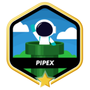

### Hello there, is Flavio here.

  

<ul>
  <li>I really love programming, and now I'm studing this awesome world at 42sp!</li>
  <li>Currently I'm working with Java(Spring) and Javascript(Angular)</li>
  <li>These are my badges that I got finishing my 42's projects:</li>
</ul>

<!--
**alsmd/alsmd** is a ✨ _special_ ✨ repository because its `README.md` (this file) appears on your GitHub profile.

Here are some ideas to get you started:

- 🔭 I’m currently working on ...
- 🌱 I’m currently learning ...
- 👯 I’m looking to collaborate on ...
- 🤔 I’m looking for help with ...
- 💬 Ask me about ...
- 📫 How to reach me: ...
- 😄 Pronouns: ...
- ⚡ Fun fact: ...
-->
